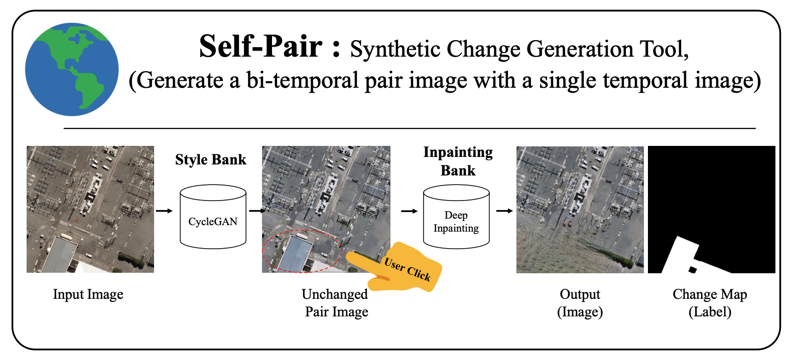

# Self-Pair: Synthesizing Changes from Single Source for Object Change Detection in Remote Sensing Imagery ([WACV2023](https://arxiv.org/abs/2212.10236))
<div align="center">
  
</div>


## Install

```
pip install -U openmim
mim install mmcv-full

git clone https://github.com/seominseok0429/Self-Pair-for-Change-Detection.git
cd open-cd
pip install -v -e .
```

#### train
```
python tools/train.py configs/changer/changer_ex_r18_512x512_40k_levircd.py --work-dir ./changer_r18_levir_workdir --gpu-id 0 --seed 307
```

## Results

| Method    | Backbone | Dataset | Param (M)  | MACs (G)  | Precision |  Recall | F1 | config                                                                                                                                 | 
| --------- | -------- | --------- | ------: | -------: | -------------- | ----: | ------------- | -------------------------------------------------------------------------------------------------------------------------------------- | 
| Changer (ChangerEx) | ResNet18   | LEVIR-CD |  11.39 |     23.71 | 92.24           | 91.09 |  91.66        |  changer_ex_r18_512x512_40k_levircd.py
| Changer + Self-pair (ChangerEx) | ResNet18   | LEVIR-CD |  11.39 |     23.71 | TODO           | TODO |  TODO        |  TODO

## Citation

If you find this project useful in your research, please consider cite:

```bibtex
@article{seo2023selfpair,
  title={Self-Pair: Synthesizing Changes from Single Source for Object Change Detection in Remote Sensing Imagery}, 
  author={Minseok Seo, Hakjin Lee, Yongjin Jeon, Junghoon Seo},
  year={2023},
  eprint={2212.10236},
  archivePrefix={arXiv},
  primaryClass={cs.CV}
}

@article{fang2022changer,
  title={Changer: Feature Interaction is What You Need for Change Detection}, 
  author={Sheng Fang and Kaiyu Li and Zhe Li},
  year={2022},
  eprint={2209.08290},
  archivePrefix={arXiv},
  primaryClass={cs.CV}
}


@misc{opencd2022,
    title={{Open-CD}: An open source change detection toolbox},
    author={Open-CD Contributors},
    howpublished = {\url{https://github.com/likyoo/open-cd}},
    year={2022}
}
```
## Thank to

This code is heavily based on [open-cd](https://github.com/likyoo/open-cd).

We thank the authors of that code.


